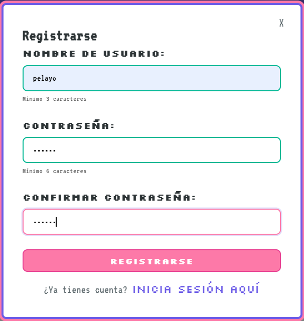
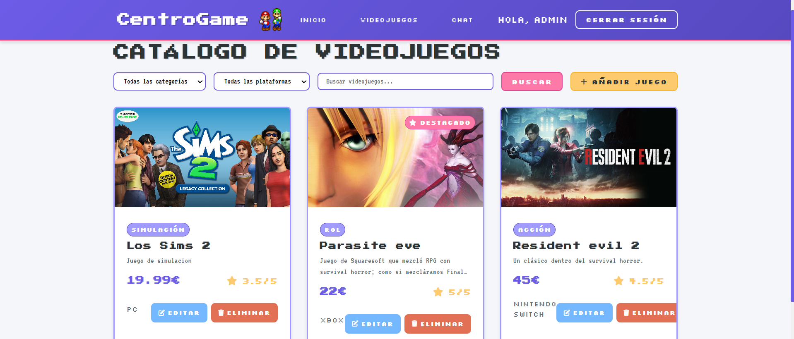
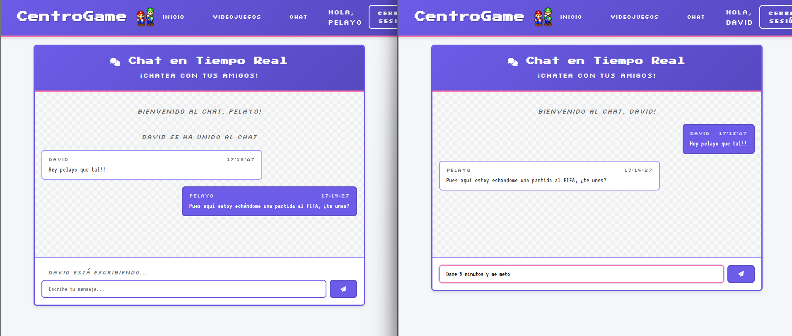

# 🎮 Tarea 1 de Programación Web - CentroGame


## Bienvenidos a CentroGame, una aplicación web completa de gestión de videojuegos en el que incluimos:

## 🛡️ Acceso seguro - Áreas privadas protegidas con tokens JWT.


## 🔐 Sistema de login y registro - Cualquiera puede registrarse. 


## 👥 Dos tipos de usuarios - Usuarios normales y administrador.


## 📦 Gestión de juegos - El administrador puede agregar, editar y eliminar juegos.  


## 💬 Chat en vivo - Los usuarios registrados pueden chatear entre sí  


---

## ¿Como lo he creado?
- Lo primero que hice fue replicar la estructura que venía en el pdf. Luego lo que hice fue configurar el package.json con las dependencias básicas como express y mongoose para finalmenteluego crear un servidor Express simple en server.js conectado a MongoDB.
- Para la autenticación, comencé por el modelo de Usuario con email, password y luego hice al administrador (que ya viene creado por defecto dentro del código). Desarrollé las rutas de registro y login que generan tokens JWT, y creé el middleware authenticateJWT.js para proteger las rutas privadas verificando los tokens.
-Luego implementé el sistema de juegos con su modelo y las rutas CRUD, diferenciando acceso entre usuarios normales (solo ver) y administradores (crear, editar, eliminar). Para el chat, usé Socket.io creando una interfaz simple en chat.html
- Finalmente en el frontend, desarrollé index.html con login/registro y estilos CSS básicos, mientras client.js manejaba las peticiones a la API.

---

## 🛠️ Tecnologías utilizadas

| Tipo | Tecnología |
|------|-------------|
| Lenguaje | JavaScript / HTML |
| Base de datos | MongoDB |
| Estilo | CSS |

---

## ⚙️ Instalación y uso

1. **Clona el repositorio en VS Code**
   ```bash
   git clone https://github.com/RaulPlayo/Tarea1ProgramacionWeb

2. **Una vez ya clonado el repositorio, escribiremos en terminal lo siguiente: cd Tarea1/src**.

3. **Finalmente, escribimos una vez dentro de src: node server.js; y ya tendríamos la página corriendo en localhost:3000**

**NOTA** Si al ejecutarlo sale un error, instalaremos node, mongoose, cors y path con este comando: npm insall express mongoose cors path


---
